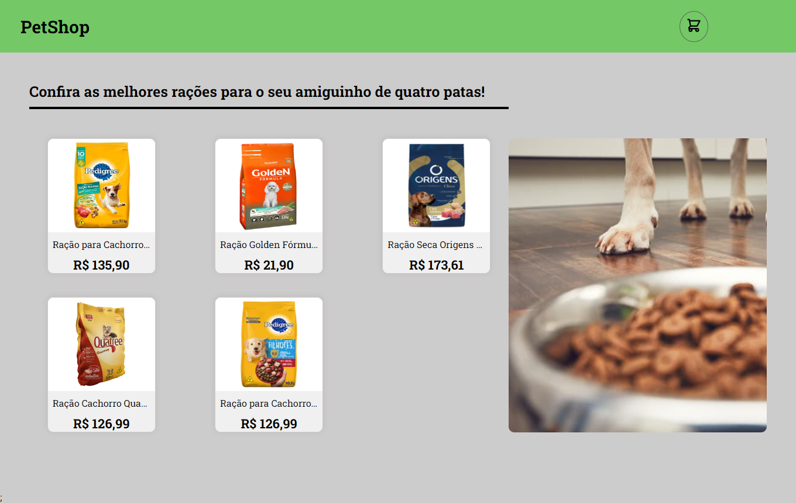
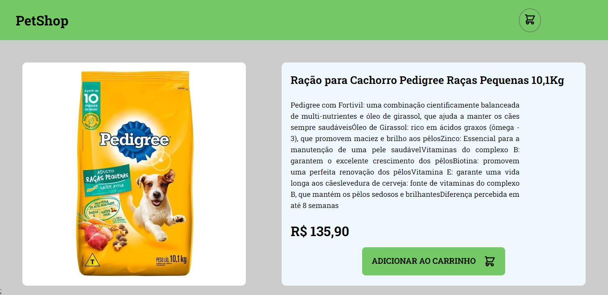
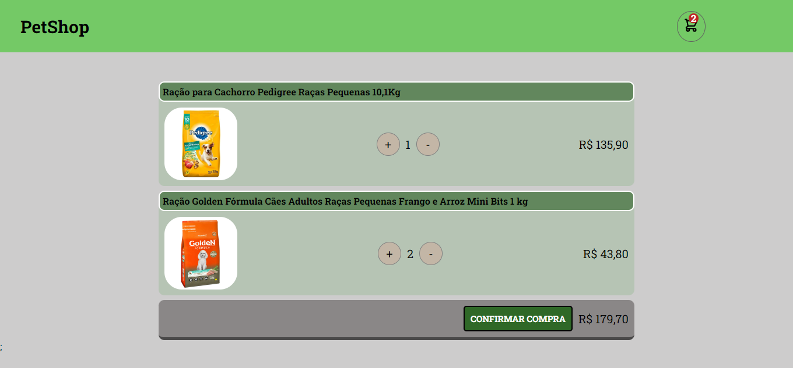
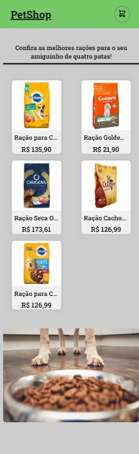
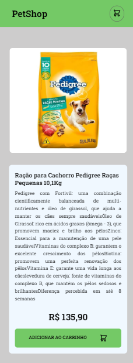
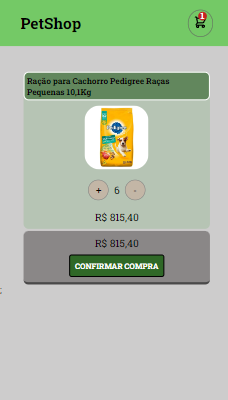

# PetShop

Um projeto de estudos de e-commerce chamado **PetShop** usando uma API falsa, onde os usuários podem navegar por  produtos para pets, visualizar suas descrições, adicionar itens ao carrinho e verificar suas compras.  

## Funcionalidades

-- **Página Inicial**: A home exibe uma grade de produtos disponíveis, permitindo que os usuários visualizem rapidamente o que está à venda.  
  
- **Detalhes do Produto**: Ao clicar em um produto, o usuário é redirecionado para uma página de descrição detalhada, que fornece informações adicionais sobre o item, os usuários podem adicionar produtos ao carrinho clicando no botão de compra.

- **Carrinho de Compras**: Atualiza automaticamente a quantidade e o valor total dos itens no carrinho. A página do carrinho exibe todos os itens que o usuário adicionou, mostrando a quantidade e o valor de cada produto. Se não houver itens no carrinho, uma mensagem informativa é exibida, informando que não há itens adicionados.  

## Imagens

